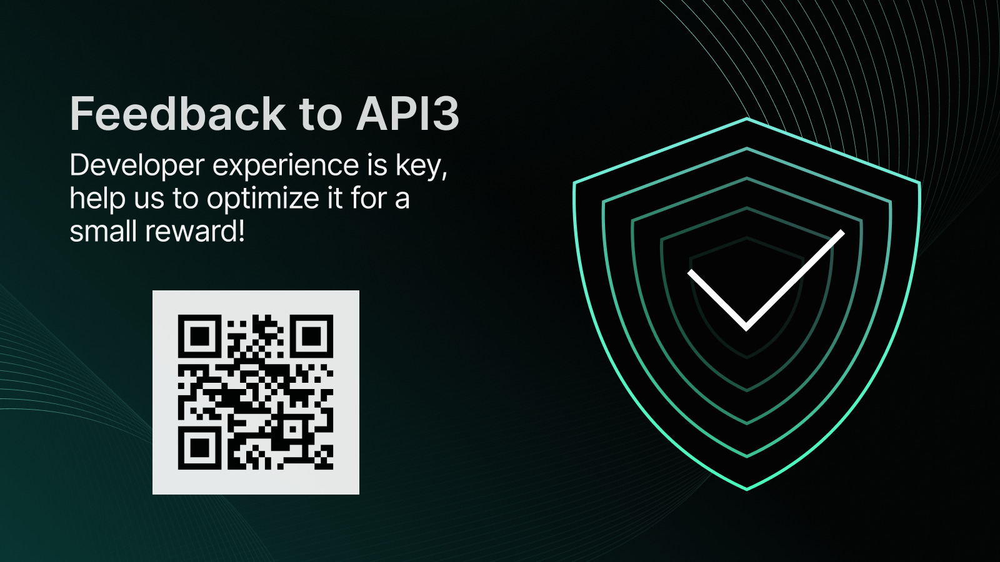

# API3 hacker challenges at EthLondon :gb::crown::hammer::city_sunset:
Hackers, we hope you are excited for the EthLondon Hackathon! We are looking forward to seeing what you build.

# API3 Bounties: Total of $5000 
We are pleased to share that API3 will be offering a total of $5000 in bounties paid out in API3 tokens.

### :trophy: Best implementation of an API3 oracle: $4000 API3 between a max of 3 winners 

We are looking for projects that utilize an API3 oracle to create a real-world use case for smart contracts. Projects must use either of the following API3 oracles:

  - API3 QRNG: Quantum Randomness (Gaming focus)
   - dAPI price feeds 
   - ChainAPI: Airnode integration tool 
   
 Please see getting started information in this repo as well as starter kits and examples in the references section.

### :money_with_wings: Best Sports Betting Application: $1000 API3 (Joint Bounty Prize with Etherspot)
-  **Must be deployed to a testnet**

API3 has provided access to Football, Cricket and Formula 1 sports betting odds. We are looking for projects that utilize the API3 sports oracle to create a sports betting application. 

Alongside utilizing the sports odds oracle, we will reward projects that utilize the API3 QRNG to generate random numbers or dAPI price feeds for sports betting applications.

Please note we have a range of endpoints pre-deployed but can deploy additional endpoints as data feeds as required through our oracle deployment tool [ChainAPI](https://chainapi.com/). 

- [Sports Betting API getting started](https://github.com/api3-ecosystem/getting-started/#making-a-request-to-the-sportmonks-f1-airnode)

## Questions? Support from API3 developers

Looking for help? Head to the API3 Discord and drop questions in the #dev-support channel: https://discord.gg/api3dao -- Or look out for API3 team members at EthLondon. 

# Introduction to API3
First-party oracles provide a more secure and reliable oracle, whilst enabling dApps to verify the data source. API3's first-party oracles are powered by Airnode, a serverless oracle node that enables API providers to run their own oracle nodes.
You can [learn more about first-party oracles](https://docs.api3.org/guides/airnode/calling-an-airnode/) within the API3 Documentation.

There are three key elements within API3's Oracle Stack:

### ChainAPI: Airnode integration tool
With ChainAPI your smart contract can connect almost any API, whether open or authenticated, by using API3's first-party oracle node, Airnode. ChainAPI enables you to integrate and deploy the open source Airnode with an intuitive step-by-step integration and deployment process.

### API3 QRNG
API3 QRNG is a public utility API3 provides on behalf of well-established, prestigious organizations serving Quantum random number generation (QRNG). QRNG is a method of random number generation based on quantum phenomena and considered within the scientific community to be the most secure method of random number generation.
It operates as a public good, where users simply add gas to a wallet correlated to the oracle node, enabling the oracle node to return a random number when requested by a contract.
Learn more about QRNG within the [API3 explore section](https://docs.api3.org/explore/qrng/).

### Data feeds: dAPIs
dAPIs provide smart contracts with access to continuously updated feeds of market data by oracles hosted by highly reputable financial data providers. API3's price feeds can be accessed in two methods:
- Self-funded dAPIs see users add collateral for oracle operation and are permissionless. They provide a data feed source with off-chain aggregation as a single-source.
- Managed dAPIs are powered by multiple first-party oracles with native-chain aggregation offering a verifiable, decentralized oracle solution.
Once a dAPI has been integrated a smart contract can access a range of data feed services through the [API3 Market](https://market.api3.org/dapis).

# Learning resources 

More reading on API3:

- [Activate self-funded dAPI](https://docs.api3.org/guides/dapis/subscribing-self-funded-dapis/)
- [Read a dAPI value](https://docs.api3.org/explore/dapis/using-dapis.html)
- [Feed Reader example](https://github.com/api3dao/data-feed-reader-example)

Tutorials: 

- [Sports Betting tools](https://github.com/api3-ecosystem/getting-started)

- [Making on-chain Payments and mint an NFT receipt using dAPIs](https://medium.com/@vanshwassan/making-an-on-chain-payment-and-minting-an-nft-receipt-with-permissionless-price-oracles-a7339f7b8c3e)

- [zkSync Paymasters with dAPIs](https://era.zksync.io/docs/dev/tutorials/api3-usd-paymaster-tutorial.html)

### References For EthLondon

Links to different repos for examples and help.

- ETH London Workshop Repo:
https://github.com/api3-ecosystem/Eth-London-Demo

- ETH CHI Workshop Repo:
https://github.com/api3-ecosystem/API3-PriceFeeds-Hardhat-Foundry

- Prediction bet between two parties
https://github.com/api3-ecosystem/Prediction-Contract

- Modified Paymaster for zkSync (Use dAPI to calculate USDC prices of Gas instead of ETH)
https://github.com/api3-ecosystem/zk-paymaster-dapi-vip

- Fork of Aave with a simulation of a flashloan
https://github.com/api3-ecosystem/Aave-Api3

- Starter kit: Starting a borrow/lend setup with WAGMI/rainbowkit front end
https://github.com/api3-ecosystem/oracle-zkevm

- Offchain API Royalty share: Pull a Youtube API and use it to pay royalties onchain
https://github.com/api3-ecosystem/offchain-music

- Or get started now with the [API3 Market](https://market.api3.org/).

# Community link

Looking for help or just want to hang with industry leading developers? Head to the API3 Discord and drop questions in the #dev-support channel: https://discord.gg/api3dao

## Submission Requirements

All hackathon participants who are competing for the API3 bounties are required to submit a project that meets the following requirements:

- The project should be submitted to the ETH London Hackathon 2023 by the deadline.
- Use of API3’s self-funded dAPIs that facilitates a proper use-case.
- The project should be live with a working frontend deployed.
- The project should be open-source with a public Github repository with the codebase. 
- The repo must be licenced with one of the following open source licences: GPL-3.0, or MIT.

# Judging criteria

Participants may submit a maximum of 1 project by the hackathon deadline. After submission, projects will be judged by the following criteria:

- **Real-world Functionality**: How well does the project work? Does it meet the minimum requirements?

- **Technical Difficulty**: How technically challenging was it to build the project?

- **Originality**: How original is the idea? How much does it differ from other existing solutions?

- **Design**: How well-designed is the project? Is it easy to use? Is it visually appealing?

- **BONUS** - Adding functionality to the Airnode protocol that will improve performance, interoperability, or further develop use cases.

# Leave your feedback 

API3 is offering $20 for hackers who provide feedback on their experience of API3's documentation. 

